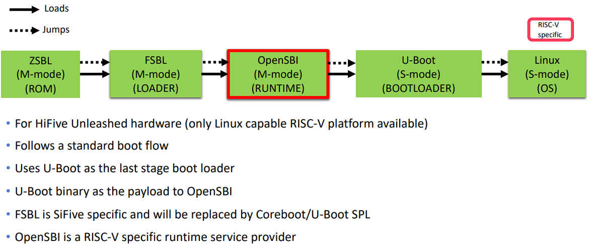
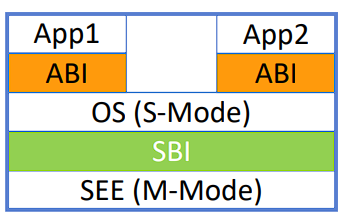

# BOOT

## RISC-V Privilieged ISA
- M-mode: bootloader, firmware 
- S-mode: kernel, hypervisor
- U-mode: user processes

## boot process
> This process maybe different from chip type.  


```
ZSBL -> Reset Code -> FSBL(BBL) -> Linux -> init(Busybox)
                        |
                        v
1. Zero Stage Bootloader(ZSBL): Get core code from ROM.
2. Reset Code: Clear Registers and RAM, prepare space for FSBL in RAM.
3. First Stage Bootloader(BBL): Set trap table, copy SELF to RAM, load Linux kernel from SD card.
4. Linux: Install page table, load drivers, prepare runtime.
5. init(Busybox): Start a shell.
-----------------------------------------------------------------------------------------
1. boot from rom, load SPL to SRAM, jump to SPL
2. SPL init DDR, load OpenSBI & U-Boot to DDR, jump to DDR
3. run OpenSBI, init some settings, jump to U-Boot
4. U-Boot load OS to DDR, parse and unzip it, run it
5. at last only OpenSBI & Linux running, Linux use sbi instructions to use OpenSBI
```



## Projects
> The projects blow is in the SDK of Milk Duo

### OpenSBI
opensbi: RISC-V Open Source Supervisor Binary Interface

1. A platform-specific firmware running in M-mode and a bootloader, a hypervisor or a general-purpose OS executing in S-mode or HS-mode.
2. A hypervisor running in HS-mode and a bootloader or a general-purpose OS executing in VS-mode.

There are three mode in OpenSBI
- **FW_PAYLOAD**: combine the OpenSBI with Bootloader, usually U-Boot.
- **FW_JUMP**: jump to next address to run the bootloader.
- **FW_DYNAMIC**: carry a param when jump to next bootloader.



### u-boot

u-boot(Universal BootLoader): a boot loader for Embedded boards based on PowerPC, ARM, MIPS and several other porcessor, which can be installed in a boot ROM and used to initialize and test the hardware or to download and run application code.

When a board connect power, if the board set use sdcard to boot, it will copy some codes from the sdcard to inner SRAM, becase the cpu don't know the type of the DDRAM and can't init it. That's why it must use the inner SRAM to boot.

The u-boot will slip into two pieces of code we called stage1 and stage2.The stage1 codes named SPL or MLO is small enough (alway near 60KB) so that it can be place into SRAM. The stage2 named u-boot.bin is near 360KB will not be load first.

### buildroot

Buildroot is a set of Makefiles and patches that simplifies and automates the process of building a complete and bootable Linux enviroment for an embedded system, while using cross-compilation to allow building for multiple target platforms on a single Linux-based development system.

## reference
- duo-buildroot-sdk: https://github.com/milkv-duo/duo-buildroot-sdk
- RISC-V启动引导流程 spec: https://www.cnblogs.com/cfas/p/16880724.html
- opensbi: https://github.com/riscv-software-src/opensbi
- OpenSBI背景介绍/编译/启动，以及和Linux交互: https://www.cnblogs.com/arnoldlu/p/18170952
- opensbi下的riscv64裸机系列编程1(串口输出): https://cloud.tencent.com/developer/article/1770529
- u-boot: https://github.com/u-boot/u-boot
- An Introduction to RISC-V Boot FLow: https://riscv.org/wp-content/uploads/2019/12/Summit_bootflow.pdf 
- QEMU 启动方式分析（2）：QEMU virt 平台下通过 OpenSBI + U-Boot 引导 RISCV64 Linux Kernel: https://tinylab.org/boot-riscv-linux-kernel-with-uboot-on-qemu-virt-machine/