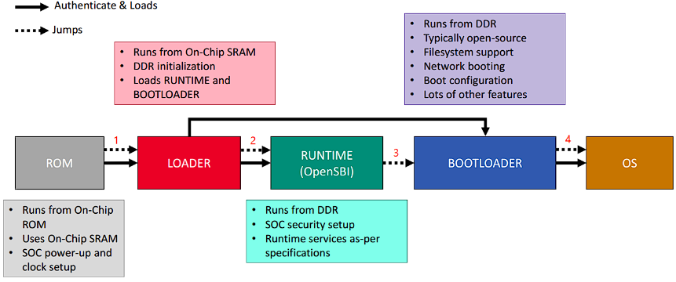

# BOOT

## RISC-V Privilieged ISA
- M-mode: bootloader, firmware 
- S-mode: kernel, hypervisor
- U-mode: user processes

## boot process
> This process maybe different from chip type.  



```
ZSBL -> Reset Code -> FSBL(BBL) -> Linux -> init(Busybox)
                        |
                        v
1. Zero Stage Bootloader(ZSBL): Get core code from ROM.
2. Reset Code: Clear Registers and RAM, prepare space for FSBL in RAM.
3. First Stage Bootloader(BBL): Set trap table, copy SELF to RAM, load Linux kernel from SD card.
4. Linux: Install page table, load drivers, prepare runtime.
5. init(Busybox): Start a shell.
-----------------------------------------------------------------------------------------
1. boot from rom, load SPL to SRAM, jump to SPL
2. SPL init DDR, load OpenSBI & U-Boot to DDR, jump to DDR
3. run OpenSBI, init some settings, jump to U-Boot
4. U-Boot load OS to DDR, parse and unzip it, run it
5. at last only OpenSBI & Linux running, Linux use sbi instructions to use OpenSBI
```

> The project blow is in the SDK of Milk Duo

### OpenSBI
opensbi: RISC-V Open Source Supervisor Binary Interface

1. A platform-specific firmware running in M-mode and a bootloader, a hypervisor or a general-purpose OS executing in S-mode or HS-mode.
2. A hypervisor running in HS-mode and a bootloader or a general-purpose OS executing in VS-mode.

There are three mode in OpenSBI
- **FW_PAYLOAD**: combine the OpenSBI with Bootloader, usually U-Boot.
- **FW_JUMP**: jump to next address to run the bootloader.
- **FW_DYNAMIC**: carry a param when jump to next bootloader.

### u-boot

### buildroot

## boot by bootLoader


## reference
- duo-buildroot-sdk: https://github.com/milkv-duo/duo-buildroot-sdk
- RISC-V启动引导流程 spec: https://www.cnblogs.com/cfas/p/16880724.html
- opensbi: https://github.com/riscv-software-src/opensbi
- OpenSBI背景介绍/编译/启动，以及和Linux交互: https://www.cnblogs.com/arnoldlu/p/18170952
- opensbi下的riscv64裸机系列编程1(串口输出): https://cloud.tencent.com/developer/article/1770529